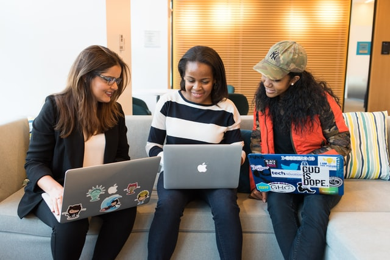

# Diversity, Equity and Inclusion in Open Source

Photo by <a href="https://unsplash.com/@wocintechchat?utm_source=unsplash&utm_medium=referral&utm_content=creditCopyText">Christina @ wocintechchat.com</a> on <a href="https://unsplash.com/s/photos/diversity?utm_source=unsplash&utm_medium=referral&utm_content=creditCopyText">Unsplash</a>
  

> "*Diversity is a number, inclusion is a process, equity is the outcome*" - Jess Mitchell

This quote is really important framing for diversity, equity and inclusion in open source. Take a moment to think about it - diversity is a **NUMBER**. While it's true that seeing an increase in number of those who have been historically unrepresented in open source can be a positive signal, it's not the end goal.  **The end goal is equity, and inclusion is the process to get there**. Open source governance needs inclusive processes to ensure equity across our projects and communities. 

> "*looking at the root causes of harm, asking those questions about what it takes to make things equal, make things right, make things fair, it requires people to be vulnerable & people who have historically held power don't like doing that*" -David Ryan Barcega Castro-Harris

In the context of building inclusive communities, this is an important reminder that equity requires we all consider power dynamics when we're building governance, and especially the enforcement of a code of conduct; that we be willing to be wrong and to learn  - which ultimately builds trust.

This course will walk you through a brief history of DEI in open source, the standards and process to support inclusion in your community including examples of how they work in practice. 

This course also comes with an activity to build Etiquette Guidelines for your community, which is a great community and team exercise. 
