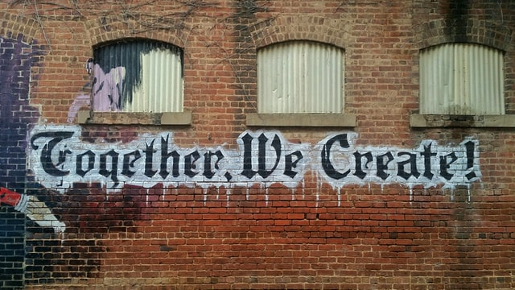

# Standards for Inclusion

Photo by <a href="https://unsplash.com/@bamagal?utm_source=unsplash&utm_medium=referral&utm_content=creditCopyText">"My Life Through A Lens"</a> on <a href="https://unsplash.com/s/photos/font?utm_source=unsplash&utm_medium=referral&utm_content=creditCopyText">Unsplash</a>

As mentioned in the previous module, having standards and process for inclusion are a critical part of moving towards the equitable future and that inclusion is the process to get us there. Our strategy to create safe and inclusive spaces includes the enforcement of our code of conduct, and encouragement for every project and community to have a set of Etiquette Guidelines that extend the Code Code of Conduct in the context of their specific workspaces, and discussion channels. 

Microsoft's Code of Conduct applies to all Microsoft projects and communities.  There are a couple of exceptions, for example .NET has its own Code of Conduct.   All GitHub repositories in the Microsoft organization are expected to include a [CODE_OF_CONDUCT.md](../CODE_OF_CONDUCT.md) file, which links to our [main document](https://opensource.microsoft.com/codeofconduct/). It's a standard.

Etiquette Guidelines are specific to your project or community, and can be built over time to address support inclusive behaviors and interactions.
  
It sometimes helps engineers to describe the Code of Conduct, and Etiquette Guidelines, as being similar in how the scope of variables work: **The Code of Conduct is global**, and **Etiquette Guidelines are local** to the project.   We will get into the details of each next.