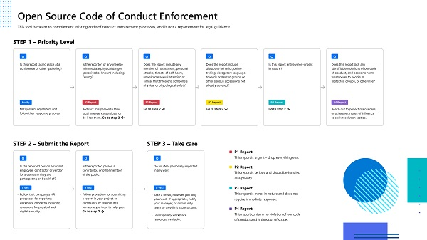

# Triaging a Report

This infographic, while only for educational use, and not a substitute for legal, HR, and other guidance, is helpful for determining how to evaluate and prioritize reports. Take a moment to review the triage steps, paying particular attention to how priority might be assigned, and order of actions to take.

For non-urgent reports the steps are fairly straightforward:

If the reported person is a current [Company] FTE, contractor, or vendor then follow the standards outline in the following resources:

* [Company] policy for reporting workplace concerns
* [Company] policy for physical and digital security

If the report does not involve a staff member, use the relevant option to your project/community:

* Contact the alias, or individual(s) listed on your project code of conduct/participation guidelines, or other governance document for enforcement.
* Reach out directly to someone you trust to help you navigate the reporting process, should it be unclear who that alias goes to, or you lack trust in one or more of those individuals.

# Available versions

* [Text based, PDF](../assets/triage-report-text.pdf)
* [Text based, Google Doc](https://docs.google.com/document/d/1MEXZDZIykxHpVGW76v0elbDZinXTkHgZ6zfX9RY08DY/edit#heading=h.f9zu6t8w9cal)
* [Text based, Word Doc](https://microsoft-my.sharepoint.com/:w:/p/emmairwin/EQfVzxHnVuxMo2vqSE7tAVMBM7PCuuvh98fxTJeqpuA0UA?e=Kjlhwa)
* [Infographic - Light JPG](../images/Final-light-mode_external.jpg)
* [Infographic - Light PDF](../images/Final-light-mode_external.pdf)
* [Infographic - Dark JPG](../images/Final-light-mode_external.jpg)
* [Infographic - Light PDF](../images/Final-light-mode_external.pdf)